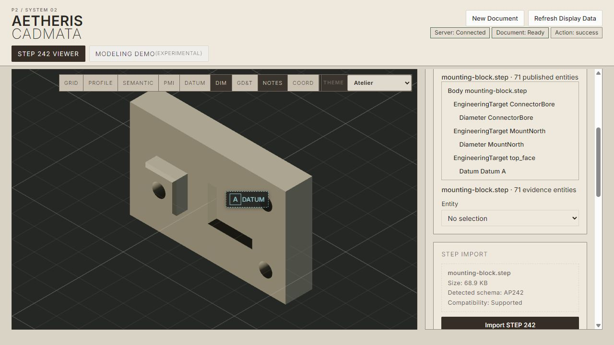
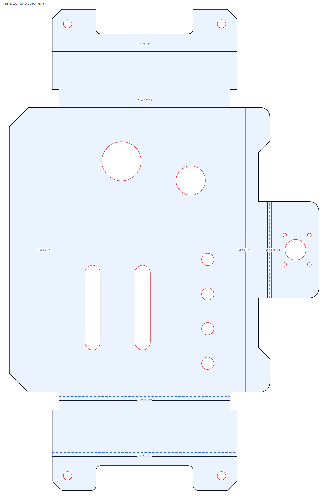

# Aetheris 2.0.0-preview.3

Aetheris is a semantic, compiler-style CAD system. You author engineering intent in **Firmament**; Aetheris lowers it through geometry, manufacturing, and analysis subsystems; **STEP AP242** is the primary exchange and product-definition artifact; **Cadmata** presents the resulting geometry and semantic PMI; and **Forge.Host** lets any process invoke qualified Firmament Templates without embedding the kernel.

```text
Firmament intent -> Aetheris lowering -> STEP AP242 / manufacturing / analysis
                              |                    |
                              +-> Forge.Host       +-> Cadmata
```

Preview 3 is feature-frozen and qualified for **Windows x64**. Its public surface is deliberately bounded: supported operations produce inspectable artifacts, while unsupported intent fails with named diagnostics. See the [support matrix](docs/public/reference/supported-features.md) for the exact boundary.



*The canonical ordinary-CAD witness: Boss, finite Pocket, hole family, perimeter EdgeFinish, AP242, and semantic PMI in Cadmata.*

## What Preview 3 supports

- Firmament V2 semantic authoring with typed Records, Templates, Static specialization, tables, and engineering references
- bounded analytic and prismatic solid modeling, including connected Boss, finite Pocket, holes, slots, patterns, and admitted EdgeFinish routes
- deterministic STEP AP242 import/export and semantic manufacturing PMI
- formed and flat Sheet Metal workflows with material, bend, opening, DFM, STEP, and SVG outputs
- Cadmata 3D inspection with PMI filtering, associations, and selection
- a deployed Standard Library material catalog
- bounded cut-cell/vector-lattice linear-elastic FEA over native Firmament or qualified `inlineSTEP`
- Firmament Template discovery and invocation through Forge Host Protocol v1, qualified with Python, Go, Rust, and TypeScript clients


*CTC-03 manufacturing AP242 in Cadmata: formed geometry, datums, dimensions, position controls, annotations, and geometry associations.*

## Try it

The easiest complete experience is the `Aetheris-2.0.0-preview.3-win-x64.zip` release bundle. It includes the CLI, Cadmata, NativeAOT Forge Host, public documentation, examples, and material catalog. The standalone .NET tool provides the CLI but not Cadmata:

```powershell
dotnet tool install --global Aetheris.CLI --version 2.0.0-preview.3
aetheris --version
aetheris build fixtures/Canonical/PMI/hole-diameter-and-datum.firmament --output out/first-part.step --json
aetheris analyze out/first-part.step --json
```

Go next to [Getting Started](docs/public/getting-started.md), the [public documentation](docs/public/README.md), or the [CLI reference](docs/public/reference/cli.md). The [machined mounting block](fixtures/Canonical/Integration/machined-mounting-block.firmament) is the canonical first serious CAD example; the [L-bracket](fixtures/Canonical/SheetMetal/l-bracket-with-hole.firmament) is the introductory Sheet Metal example; and the [A36 cantilever](fixtures/Canonical/FEA/material-resolved-cantilever.firmament) is the analytically interpretable FEA witness.



*A qualified flat-pattern artifact. Preview 3 emits formed STEP, flat STEP, SVG, bend identity, material identity, and DFM evidence on the documented Sheet Metal routes.*

## Why Aetheris?

Aetheris keeps engineering semantics alive through lowering instead of treating them as labels added after geometry. STEP AP242 is a primary artifact, PMI is semantic and associated with geometry, Sheet Metal carries formed/flat/fabrication meaning, and FEA consumes native or qualified imported STEP geometry. Forge.Host keeps cross-language integration small: clients list, describe, and invoke Templates through files and JSON.

```powershell
$host = ".\forge-host\Aetheris.Forge.Host.exe"
& $host list
& $host describe Standard.SheetMetal.ElectronicsEnclosure
python .\samples\forge-interop-x1\python\client.py $host .\samples\forge-interop-x1\request.json .\out\forge-python
```

The bundle contains equivalent [Go, Rust, and TypeScript clients](samples/forge-interop-x1/README.md). Forge Host Protocol v1 is independently versioned from Aetheris `2.0.0-preview.3`.

## Installation surfaces

| Surface | Use | Preview 3 status |
|---|---|---|
| Windows release ZIP | Complete CLI + Cadmata + Forge.Host experience | Qualified on `win-x64` |
| `Aetheris.CLI` .NET tool | Firmament, STEP, Sheet Metal, and FEA commands | Published package; Cadmata not included |
| Public NuGet libraries | Direct .NET integration | 16 version-aligned packages |
| Forge.Host | Language-neutral Template invocation | NativeAOT `win-x64`, Protocol v1 |
| VS Code extension | Firmament syntax and CLI-backed commands | Independently versioned `0.3.0-preview.3` VSIX |

Linux and macOS release binaries are **not** qualified in Preview 3. Framework-level portability tests do not expand the release-binary promise.

## License and acknowledgments

Aetheris code is licensed under the [GNU Affero General Public License v3.0](LICENSE). Alternative licensing is available on request. Third-party assets retain their own terms and provenance; see [THIRD_PARTY_NOTICES.md](THIRD_PARTY_NOTICES.md).

Special thanks to the National Institute of Standards and Technology (NIST) for STEP AP242 test models used in development and validation. Their presence does not imply NIST endorsement or place those models under the Aetheris license. Stanford Bunny provenance is recorded separately in the third-party notices.

External contributions are welcome under the process in [CONTRIBUTING.md](CONTRIBUTING.md). The proposed contributor license agreement is a **candidate pending human attorney review** and is not yet an operative acceptance mechanism.
