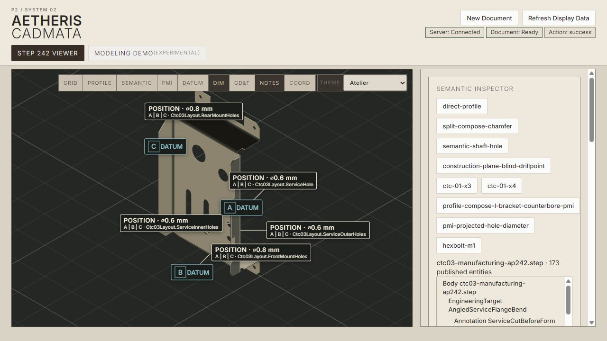
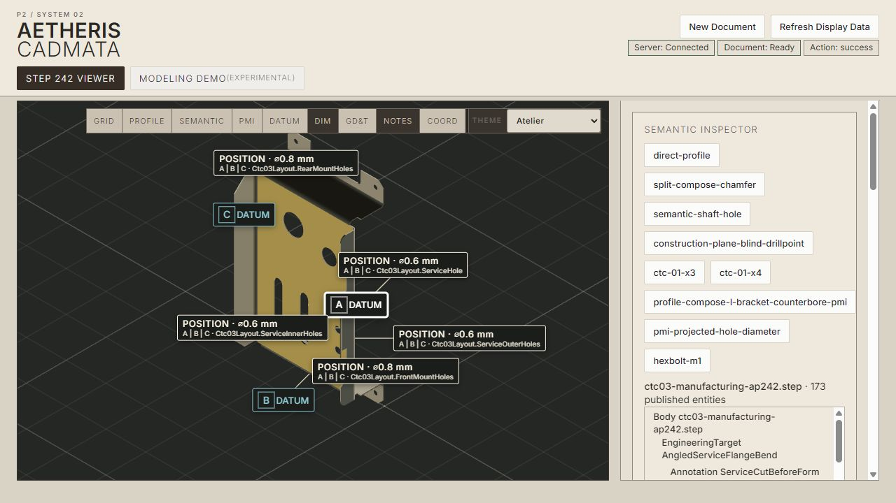
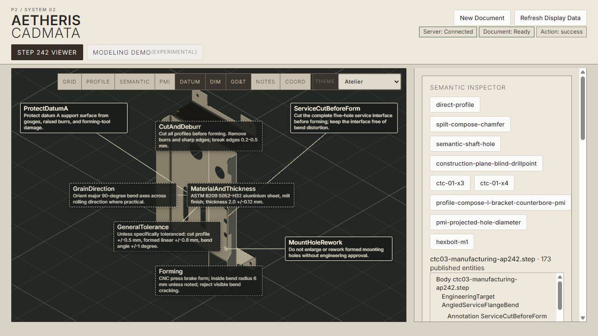
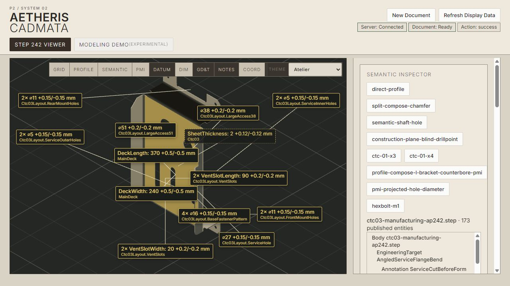

# CADMATA-PMI-X1 — semantic 3D PMI and annotation presentation

## Result

X1 establishes the real AP242-to-Cadmata semantic presentation path for the CTC-03 production subset. Semantic PMI and notes are imported with stable STEP-derived identity, structured engineering fields, target identities, and actual BRep face associations. Three.js receives a presentation adapter, not a duplicate engineering model.

The default view intentionally shows datums and GD&T controls. Dimensions and notes remain one-click category layers so the initial document is legible instead of displaying all 29 requirements at once.

## Architecture

```text
Firmament-authored semantic PMI
  -> STEP AP242 product-definition entities
  -> Step242SemanticPmiInspector
  -> CadmataStepSemanticBridge
       stable semantic entity identity
       structured payload and provenance
       STEP ADVANCED_FACE -> Aetheris FaceId association
  -> semantic target / PMI / BRep entities in the Cadmata application model
  -> face-derived target anchor
  -> deterministic camera-facing callout + leader presentation
  -> existing selection, picking, highlighting, and inspector paths
```

`FaceGeometryBinding.SourceStepEntityId` preserves imported `ADVANCED_FACE` provenance. The bridge resolves `GEOMETRIC_ITEM_SPECIFIC_USAGE` references through that explicit mapping; it never assumes that STEP entity order equals Aetheris topology order.

Callout screen position, collision displacement, camera-facing orientation, visibility, and user drag offset exist only in the client presentation adapter. Moving or orbiting a callout does not change its target, value, tolerance, datum frame, provenance, or face association.

Anchors are derived from associated face boundary vertices. Product-level requirements use the body-bounds center and are visually distinguished with dashed panels. Imported graphical placement/orientation is neither read nor treated as authority.

## Supported entity matrix

| Semantic entity | 3D presentation | Feature association | Selectable | Target highlight | Filterable |
| --- | --- | --- | --- | --- | --- |
| Datum | Camera-facing datum badge + leader | Datum target and associated faces | Yes | Datum feature face | Datums |
| Linear/thickness dimension | Structured name/value/tolerance panel | Target and associated faces where AP242 supplies them | Yes | Associated faces | Dimensions |
| Diameter | Quantity-aware diameter panel | Pattern/feature and cylindrical faces | Yes | All associated pattern faces | Dimensions |
| Position control | Position/value panel with ordered datum frame | Controlled target plus referenced datum targets | Yes | Controlled faces and A\|B\|C features | GD&T |
| Engineering annotation | Local/global note panel + leader | Target and faces for local notes | Yes | Associated local faces | Notes |
| Repeated-feature requirement | One quantity-bearing semantic callout | Preserves one requirement over all associated faces | Yes | Whole associated pattern | Parent category |

## CTC-03 inventory

Inventory comes from the ordinary STEP import endpoint and is asserted by `KernelApiIntegrationTests.StepImport_Ctc03PublishesStructuredSemanticPmiWithRealFaceAssociations`.

| Class | Loaded | Presented |
| --- | ---: | ---: |
| Datums | 3 | 3 |
| Toleranced dimensions/diameters | 13 | 13 |
| Position / GD&T controls | 5 | 5 |
| Engineering annotations | 8 | 8 |
| Quantity-bearing repeated-feature PMI objects | 11 | 11 |

The imported document publishes 44 engineering objects/targets (29 PMI/annotation entities plus 15 target entities) and 129 BRep face entities in one inspectable Cadmata artifact. The complete application artifact contains 173 stable entities.

## Dogfood evidence

### Clean default presentation

Datums and inspection controls are visible by default; dimensions and notes remain independently available.



### Datum interaction

Selecting datum A highlights the associated MainDeck support face and exposes stable identity, STEP provenance, target, and Aetheris face ID.



### GD&T interaction

Selecting `FrontMountPosition` exposes position `0.8 mm`, quantity `2`, controlled target `FrontMountHoles`, and ordered datum frame `A | B | C`. Its controlled faces and referenced datum features are selected through published relationships.


### Engineering annotations

The Notes filter shows all eight semantic notes. Local notes retain feature leaders; whole-part notes use a distinct dashed presentation.



### Orbit, zoom, and dimension filtering

After orbit and zoom, dimension panels remain camera-facing, leaders remain attached to semantic anchors, and the deterministic greedy layout recomputes in screen space.



Additional browser dogfood verified:

- clicking `ProtectDatumA` highlighted Face 1 and exposed its full text and STEP `#4088` provenance;
- clicking model Face 1 surfaced owners MainDeck, Datum A, DeckWidth, DeckLength, and ProtectDatumA plus STEP face `#182` provenance;
- dragging DeckWidth changed its screen rectangle while its inspected target remained `MainDeck` byte-for-byte unchanged;
- all eight notes and all thirteen dimensions were present in their filtered views;
- the default and post-orbit layouts retained camera-readable text and deterministic ordering.

## Remaining limitations

- X1 supports the production subset: datum, dimension/diameter, position, quantity, and semantic note. Composite frames, modifiers, profile, flatness, projected zones, and other AP242 PMI constructs remain unsupported.
- Face-derived anchors use associated-boundary centroids. Future feature/pattern centroid and measurement-endpoint resolvers can improve leader intent without changing semantic entities.
- The bounded greedy layout is viewport-local, not a global drafting optimizer. Dense all-category views may de-emphasize low-priority notes; the intended X1 workflow uses category filters.
- Drag offsets are volatile per viewer session. They are explicitly presentation state but are not yet persisted in a reusable presentation-hints document.
- Callout panels use modern readable HTML rather than complete ISO/ASME glyph typography. Structured semantic data remains available independently of those glyphs.
- Geometry-to-PMI discovery currently appears in the semantic inspector; a dedicated contextual action menu and LLM command surface are future presentation conveniences over the same application entities.
- Anchors and callouts are not yet lowered into Drawing IR. The bridge is independent of Three.js so drawing projection can consume the same semantic objects later.

## Validation

- `dotnet run --project Aetheris.CLI -- analyze .../ctc03-manufacturing-ap242.step --json`: 129 faces, enclosed manifold, semantic counts 3/13/5/8, zero semantic diagnostics.
- Server integration tests exercise the real import endpoint, face provenance, target associations, datum references, and inventory.
- Client tests exercise semantic category filtering, deterministic collision placement, and presentation-only manual offsets.
- Browser dogfood used the actual CTC-03 manufacturing STEP through the startup/import path, not a fixture-specific mapping.
- Full solution validation: zero build warnings/errors; 2,943 .NET tests passed serially (the FrictionLab assembly has no discoverable tests); 81 client tests, lint, and production build passed.
