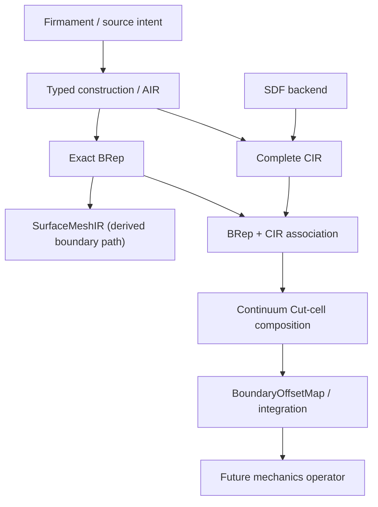

# Aetheris Continuum architecture

## Authority

- Firmament expresses typed source intent.
- AIR / typed construction recipes own constructive lowering decisions.
- BRep owns exact boundary identity, analytic supports, trims, adjacency, topology, and interchange.
- CIR (Continuum Implicit Representation) owns occupied material and continuum-region classification.
- SDF is one CIR backend/capability family; CIR is not synonymous with SDF.
- SurfaceMeshIR is a separate derived structured boundary approximation, never occupancy or exact-boundary authority.
- BoundaryOffsetMap is a derived Cut-cell-local cache, never exact geometry authority.

Generated whole-part analysis requires BRep and CIR to carry the same construction-source identity. `ExactCoaxialConstructionPlan` is the first production dual-lowered family. CIR is built analytically from prism half-spaces, cone/frustum profiles, cylinders, the concave toroidal root profile, and caps; it is not derived from BRep tessellation. The BRep is independently materialized from the same plan.

## Material side and topology orientation

`ExactSupportNormal` is the differential normal of the analytic support. `ParameterizationNormal` may apply BRep `SameSense`, but is still not an occupancy answer. `MaterialSideClassifier.ClassifyMaterialSide` probes CIR on both sides of the exact support normal and returns typed evidence. `SameSense`, face orientation, and coedge sense remain topology/parameterization evidence only.

## SDF capabilities

`SdfFieldCapabilities` distinguishes sign-correct occupancy, conservative intervals, exact Euclidean signed distance, and gradient availability. Rigid transforms preserve exact distance; non-rigid scale removes that claim. General union/intersection/subtraction retain sign and conservative interval promises but do not advertise exact Euclidean distance. Intersection `SdfBounds` is a safe union container and is explicitly not tight.

## Recovery policy

Arbitrary CIR/SDF to exact BRep is not a general inverse. Retained Firmament paths are bounded SDF decompilers for intent recovery and carry an explicit `SdfDecompilationContract`. Generated exact geometry uses AIR/typed construction to BRep directly.

Arbitrary BRep/STEP to authoritative CIR is not implemented. A future imported-solid milestone may introduce a bounded analytic-shell adapter with exact point containment and face correspondence, but M4B does not assume or simulate that conversion.

## Hard invariants

1. Core does not depend on Continuum.
2. CIR != SDF and BRep != CIR.
3. No representation is a universal replacement for another.
4. SurfaceMeshIR is never occupancy authority.
5. BoundaryOffsetMap is never exact geometry authority.
6. Generated whole-part BRep and CIR share constructive lineage.
7. Arbitrary CIR to BRep and arbitrary BRep to CIR recovery are not assumed.
8. `SameSense` is not material-side truth.
9. JudgmentEngine arbitrates genuinely competing bounded interpretations; it is not representation authority and is absent from deterministic dual lowering.
10. Geometry sampling is separate from future mechanics quadrature.

## Dependencies

`Aetheris.Continuum` depends on Core and StandardLibrary's public typed coaxial construction plan. StandardLibrary depends on Forge/Core and does not depend on Continuum. Core exposes the bounded `ContinuumConstructionDescriptor`. The sole remaining Continuum friend access is legacy AIR/prismatic mirror experimentation, recorded with an explicit removal trigger in the refactoring notes.
