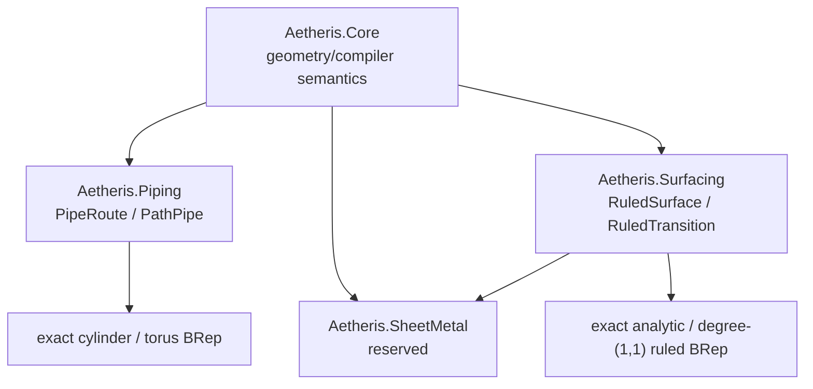

# Engineering Modules

## Why Modules exist

Aetheris Modules are typed owners of engineering-domain vocabulary, validation, Concepts, Templates, lowering, diagnostics, and public documentation. They are not UI workbenches and are not dynamically discovered plug-ins. Core remains the shared compiler/kernel substrate: exact curves and surfaces, topology, BRep, AIR/ConstructionIR, STEP, `SemanticValue`, Assembly, Drawing, and Continuum.

The M0 composition root is `BuiltInModules`. It registers explicit definitions in code and creates one deterministic `AetherisModuleCatalog`; there is no DLL scanning, reflection namespace inference, package installation, or marketplace. A future external host can pass explicit definitions through the same catalog seam without changing identity semantics.

## Model and ownership

An `AetherisModule` has an explicit dotted `AetherisModuleId`, semantic version, capabilities, Concepts, Templates, lowerings, diagnostics, bounded dependencies, and documentation metadata. IDs never come from filenames. Catalog construction rejects duplicate IDs, duplicate capability ownership, missing/old dependencies, and deterministic dependency cycles. Catalog order is dependency-first and then ordinal by ID.

`ModuleCapability` means compiler/domain functionality such as `Piping.PipeRoute`. `ISemanticCapability` means evidence exposed by a particular `SemanticValue`, such as `AxisCapable` or `BodyCapable`. The former selects an available compiler path; the latter proves what a value can safely supply. They deliberately share no base type.

## Module and Forge boundary

A Module owns a domain package and its admitted compiler capabilities. Forge Host invokes capabilities and Templates and exposes `EngineeringModules` for inspection without referencing KernelSDK. KernelSDK remains the advanced seam for implementing new low-level/custom capability executors; ordinary Module callers do not need it. Existing Forge extension packages are not reclassified as engineering Modules.

## Firmament use and collision policy

M0 adds no import keyword. Domain APIs and module-owned Templates resolve the owning Module explicitly, then lower to ordinary Firmament/Core construction or exact BRep. Forge `Construct` uses the fully qualified capability ID (`Piping.PipeRoute`, not an unqualified `PipeRoute`) at the capability boundary. Template-authored Firmament stays pleasant because its expansion uses normal short local declarations.

This choice is intentional: the current canonical Firmament grammar does not have two competing domain declarations requiring an import/name-resolution system. Adding `Use` now would create syntax without a native domain construct consumer. Tooling obtains ownership from the catalog. If native domain declarations later create real collisions, the smallest future import form can enable a Module once per document; fully qualified IDs remain the unambiguous fallback.

## M0 scope and limitations

Modules are built in and in-repository. Registration is static. Module versions are exact semantic versions, while dependencies specify minimum versions. Version ranges, unload/reload, external package acquisition, runtime scanning, and arbitrary service injection are non-goals.
