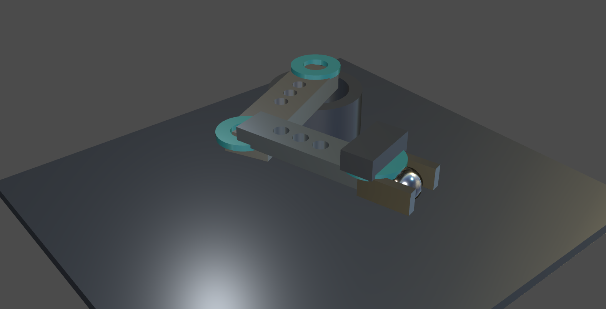
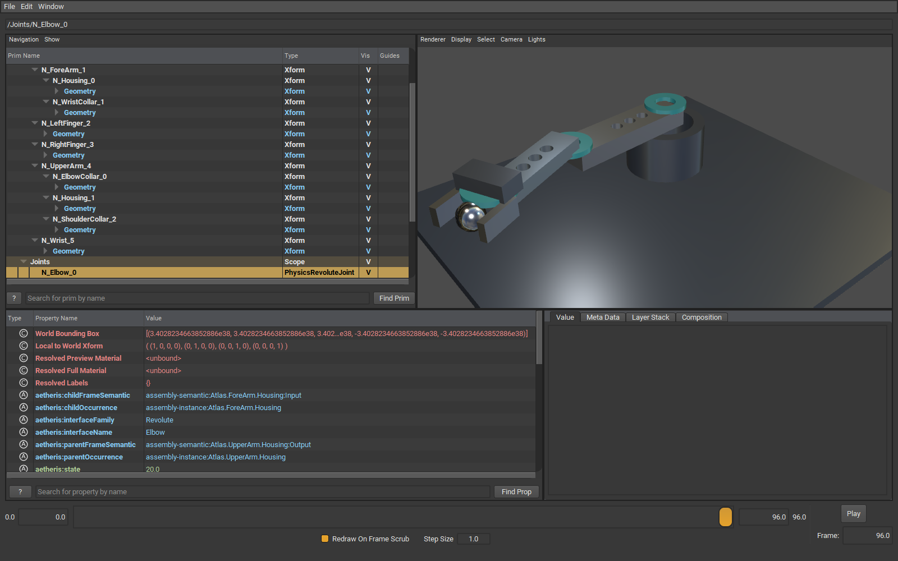
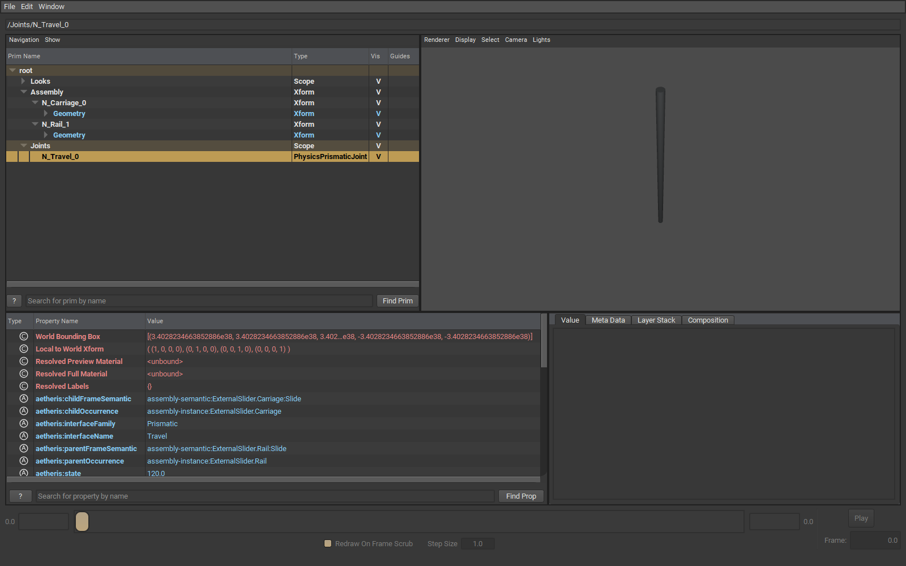

# USD-EXPORT-X0 — assembly interoperability evidence

## Executive verdict

**Accepted for X0's preferred external validation target: official OpenUSD usdview, distributed by NVIDIA.** Aetheris assemblies export to valid USD with hierarchy, shared instances, rigid placements, explicit physical scale, and standard Fixed/Revolute/Prismatic joint schemas. The files open and render in the real external viewer. The articulated ATLAS studio witness and motion clip are produced.

This is OpenUSD/Hydra Storm validation using NVIDIA's official tool distribution. Omniverse Kit, Isaac Sim, NVIDIA RTX rendering, and dynamics execution were not qualified. The result does not claim those separate capabilities. NVIDIA-specific simulation validation remains pending; the requested preferred OpenUSD viewer path is qualified.

STEP remains manufacturing/engineering interchange. USD is downstream scene, digital-twin, robotics visualization, and simulation interchange. Neither the exporter nor the studio layer changes Aetheris engineering authority.

## External validation report

- **Tool:** OpenUSD `usdview`, `usdchecker`, and the `pxr` SDK from NVIDIA's Windows prebuilt distribution; actual viewport renderer `HdStormRendererPlugin` (Hydra Storm / OpenGL).
- **Version:** OpenUSD 25.08 (`Usd.GetVersion() == (0,25,8)`); archive build `v25.08.71e038c1`, with bundled Python 3.12.
- **Source/download:** [NVIDIA OpenUSD developer resources](https://developer.nvidia.com/openusd), [pinned Windows archive](https://developer.nvidia.com/downloads/usd/usd_binaries/25.08/usd.py312.windows-x86_64.usdview.release-v25.08.71e038c1.zip). Installation is extraction into ignored `artifacts/local/usd-x0/tools/openusd`; no global SDK or Python modifications.
- **Archive SHA-256:** `61BAE28D18C873871047E7A8B3FE1FFE2188FB88FDDE113BE429812D27F0C8B4`.
- **USD files:** `artifacts/local/usd-x0/{fixed,arm,slider,occt-slider,demo,demo-studio}.usda`.
- **Opened successfully:** yes, all five assembly witnesses and the composed studio stage. External `usdchecker` reports `Success!` for every file. Composition errors: zero.
- **Warnings:** final viewer/checker runs contain no schema, composition, or rendering errors. During capture-script development, an incorrect time API call raised a Python exception and produced OpenGL teardown errors; the corrected scripts complete normally. Those failed attempts were not counted as validation.
- **Joint metadata visible:** yes; the real viewer hierarchy identifies the standard joint type, and the selected joint's properties show Aetheris family, endpoint identities, semantic frames, and state. The external SDK verifies all standard body relationships and local joint frames.
- **Screenshot paths:** `artifacts/local/usd-x0/<witness>-captures/{hierarchy,render-0}.png`, arm poses at frames 0/48/96, studio poses at frames 0/48/96. Compact durable screenshots are below and under `docs/release/usd-export-x0/`.
- **Motion:** `artifacts/local/usd-x0/atlas-motion.mp4`, encoded from actual external-viewer captures of the 97-pose exported scene; four seconds at 24 time codes/second.

The tool/workflow follows [NVIDIA's usdview quickstart](https://docs.omniverse.nvidia.com/usd/latest/usdview/quickstart.html). To open the final studio interactively:

```powershell
artifacts/local/usd-x0/tools/openusd/scripts/usdview.bat `
  artifacts/local/usd-x0/demo-studio.usda --camera /Presentation/HeroCamera
```





## Lowering and schemas

The API is `AssemblyUsdExporter.Export(AssemblyM1CompilationResult, AssemblyUsdOptions)`; `Serialize` reuses prepared production geometry without tessellating again. The CLI is `aetheris asm export-usd <source> [out.usda]`. All geometry comes through `AssemblyM1Pipeline`/the `.firmasm` document compiler and `AssemblyDisplayMeshExporter`. Failed geometry, unresolved transforms, mismatched pose metadata, non-finite data, reflected transforms, and unknown material definitions fail visibly. Geometry is never inferred from joint labels.

| Source authority | USD representation |
|---|---|
| Product tree | Nested `/Assembly` `Xform` prims; local transforms derived as world × inverse(parent-world) |
| Reusable part BRep definition | One production mesh per definition in abstract `/Definitions`; occurrence `Geometry` has an internal instanceable reference |
| Occurrence / definition identity | `aetheris:occurrenceIdentity`, `aetheris:definitionIdentity`, `aetheris:sourcePath` |
| Source assembly | `aetheris:sourceName` |
| Display mesh | Triangle `Mesh`, vertex normals retaining sharp face boundaries, right-handed orientation, no subdivision |
| Preview color / metal / roughness | `UsdPreviewSurface`, `MaterialBindingAPI`, and display-color primvar |
| Fixed | `PhysicsFixedJoint` |
| Revolute | `PhysicsRevoluteJoint`, `physics:axis = "Z"` |
| Prismatic | `PhysicsPrismaticJoint`, `physics:axis = "Z"` |
| Parent / child | `physics:body0/1` relationships to original occurrence prims |
| Authored zero frames | `physics:localPos0/1`, `physics:localRot0/1`; original double matrices retained as `aetheris:zeroFrame0/1` |
| Family / scalar state | Namespaced interface name/family, semantic frame IDs, zero state, current state, and degree/mm state unit |
| Kinematic body / articulation | `PhysicsRigidBodyAPI` with kinematic enabled on joint endpoints; `PhysicsArticulationRootAPI` on assembly root |
| Optional motion | Evaluated translation/quaternion and scalar-state time samples |

The audit used the official [USD Physics overview](https://openusd.org/release/api/usd_physics_page_front.html), [joint schema](https://openusd.org/release/api/class_usd_physics_joint.html), [RevoluteJoint](https://openusd.org/release/api/class_usd_physics_revolute_joint.html), [PrismaticJoint](https://openusd.org/release/api/class_usd_physics_prismatic_joint.html), and [NVIDIA's joint-schema support](https://docs.omniverse.nvidia.com/usd/code-docs/usd-exchange-sdk/latest/api/group__physicsjoints.html). These standard schemas directly fit the accepted Interface frame model; no Aetheris semantic redesign or geometry-based joint inference was necessary.

The current accepted assembly IR does not carry engineering material density, per-occurrence mass, center of mass, or principal inertia. Those properties are therefore omitted rather than synthesized. USD Physics MassAPI can represent them when authoritative inputs are available. Authored limits are absent in Interface X0 and are not invented. Collision geometry is unnecessary for the qualified viewer path and is not authored. No collision decomposition, dynamics, IK, or trajectory planner was added.

## Units and coordinates

Aetheris geometry and state remain millimetres. The stage explicitly authors `metersPerUnit = 0.001`, `upAxis = "Z"`, and right-handed mesh orientation. Transform translation values retain millimetres; rotations are unitless quaternions. No implicit 1 mm = 1 metre interpretation or axis swap occurs. Revolute state is degrees; Prismatic state is mm. Joint local positions are stage units, matching their body geometry.

The OCCT rod has a 10 mm diameter and 200 mm length: it represents 0.010 m × 0.200 m in USD. Its carriage moves 120 mm (0.120 m). The fixed witness includes a 45-degree nested parent rotation and a translated parent, so relative composition is tested beyond identity groups. External `UsdGeom.XformCache` verifies every occurrence world transform against Aetheris, and quaternion interpolation is checked for rigid intermediate frames.

The late request for metre authoring was explicitly conditional on being easy. It is **deferred**: typed literal classification, template and static evaluation, PMI, policy lengths, and multiple geometry profiles currently require mm. Merely accepting `Units: m` would produce inconsistent engineering scale. The bounded exporter does not introduce such a parser patch. Public documentation calls out this limitation.

## Witnesses and provenance

| Witness source under `fixtures/Canonical/AssemblyInterfaces/` | Evidence |
|---|---|
| `fixed-nested-usd.firmament` | Fixed schema, three uses of one sleeve definition, nested rotated/translated product group |
| `two-link-arm-usd.firmament` | Same ports, frames, and joint graph as canonical `two-link-arm.firmament`, with ordinary exact part templates added for materialization; two links share one definition |
| `external-step-slider.firmament` | Accepted Interface witness and its existing STEP-file intake path |
| `external-occt-slider-usd.firmament` | Same Prismatic contract using actual third-party `testdata/step242/OCCT/rod.step`; STEP header identifies FreeCAD / Open CASCADE STEP processor 7.8 |
| `physical-ai-demo.firmament` | ATLAS nested assembly, 6 definitions / 9 part occurrences / 12 total occurrences, 8 joints, 97 evaluated poses |

The accepted slider's original STEP file identifies Aetheris as its producer. It is useful regression evidence for file intake but is not third-party authorship evidence. The separate OCCT witness corrects that distinction without rewriting the accepted Interface fixture.



## Investor demo

ATLAS is a compact pedestal manipulator with a visibly articulated two-link arm, perforated mechanical housings, repeated cyan joint collars, and a two-finger translating gripper around a chrome target. The metal palette, studio reflections, nested mechanical parts, and obvious motion make the interoperability result usable on a slide without a long technical explanation.

Aetheris exercises exact circle/rectangle profiles, multi-loop perforated extrusions, shared definitions, nested occurrence hierarchy, datum frames, Fixed/Revolute/Prismatic interfaces, and deterministic state-to-pose. The assembly's exact geometry and kinematic frames are engineering authority. The appearance JSON is a downstream preview preset. The separate USD studio layer contains presentation-only floor, lighting, camera, and chrome sphere. The sphere follows the wrist as visual choreography; it does not claim contact simulation or physical grasping.

Motion changes Shoulder 5→25→5 degrees, Elbow 20→80→20 degrees, and both finger slides 14→8→14 mm over 97 frames. Every authored frame comes from Aetheris kinematics. USD translation/quaternion interpolation remains rigid, but sparse occurrence interpolation does not guarantee exact joint-constrained trajectories between authored frames; the demo uses one authoritative sample per frame.

## Qualification and reproduction

```powershell
pwsh -File scripts/qualify-usd-export-x0.ps1 -CaptureMotion
dotnet build Aetheris.slnx -c Release --no-restore -m:1
dotnet test Aetheris.Kernel.Core.Tests -c Release --no-build --filter "Category!=SlowCorpus"
dotnet test Aetheris.slnx -c Release --no-build -m:1 -- RunConfiguration.MaxCpuCount=1
```

`-UsdRoot <existing-install>` reuses a local NVIDIA OpenUSD distribution. `-OutDir` changes the otherwise ignored output directory. `-SkipBuild` is appropriate after the listed build. The installer verifies the pinned archive hash. `-CaptureMotion` also needs `ffmpeg`; the core export/viewer qualification does not.

The external Python qualification checks composition errors, units, up-axis, hierarchy, exact occurrence identities, shared native prototypes, material bindings, triangle/normals preservation, standard joint types/endpoints/local frames, default and sampled world transforms, display bounds, and welded triangle closure. All exported definitions have zero unmatched mesh edges. Tight transformed display bounds agree within 0.0001 mm; USD's conservative scene bounds agree with independently transformed Aetheris local display bounds within the same threshold. Conservative bounds can exceed tight bounds for a rotated cylindrical collar; that is normal bounding-box behavior, not changed part placement.

Measured results are recorded in `artifacts/local/usd-x0/qualification-summary.json`. The committed compact summary retains bounded validation/performance evidence; raw meshes, USD files, logs, tool installation, HDR asset, and video stay ignored/local. Screenshot byte stability is not promised across GPU/driver/platform versions; they are direct captures of the real external viewer, with the scripts and source files above providing provenance.

Final validation on this checkout: Release solution build passed (7 existing WebAssembly/SQLite interop warnings); fast lane passed 1,005 tests; full serial solution gate passed all 4,009 discovered tests, zero failures and skips. FrictionLab exposes no discoverable tests. The USD regression tests exercise posed definition reuse, culture-independent serialization, actual OCCT intake, nested Fixed placement, all accepted joint families, and fail-closed invalid state/appearance paths. Existing Interface/assembly/corpus tests remain green. Repository layout and `git diff --check` passed.

| Witness | Display mesh ms | USDA serialization ms | File bytes | External SDK load ms | Maximum world-matrix error |
|---|---:|---:|---:|---:|---:|
| fixed | 108.96 | 10.37 | 37,598 | 14.54 | 4.4e-16 |
| arm | 66.08 | 12.60 | 22,425 | 14.77 | 5e-16 |
| slider | 7.59 | 12.43 | 24,610 | 14.91 | 0 |
| occt-slider | 77.20 | 9.98 | 14,589 | 12.40 | 0 |
| demo | 185.42 | 28.29 | 348,199 | 24.14 | 1.6e-15 |

These are one-run development measurements, not optimized benchmarks. The demo contains 2,584 triangles across 6 shared definitions and 97 authored poses; nine part occurrences reuse those definitions. Its studio stage opened in usdview in about 0.06 seconds, with UI startup around 0.9 seconds. The compact [qualification summary](usd-export-x0/qualification-summary.json) records the measured errors and counts. Floating display-point conversion contributes at most 0.000000563 mm of tight-bounds discrepancy in these witnesses; every occurrence default/sample matrix agrees within 1.7e-15. No optimization was required.

## Known boundaries

The follow-on [industrial ATLAS styling round](USD-INDUSTRIAL-ATLAS-X0.md) adds a separate smooth exact housing witness and a direct Cycles render of the USD import. The original X0 witnesses and their measurements above remain the first milestone record.

One-way export only. No full BRep USD encoding, import/roundtrip, dynamics, IK, general material system, collision engine, robot control, or USD ecosystem implementation. Preview meshes use USD float positions/normals, while occurrence placement and preserved zero-frame matrices use doubles. Standard joint positions/quaternions use the schema's float types and are verified within 1e-6. Legacy axis/seat-only Revolute forms do not acquire an invented angular zero. Unresolved group placement must be authored/compiled before display export. Mass/density/inertia and limits need authoritative assembly inputs. Separate Omniverse/Isaac/RTX simulation validation remains pending.
