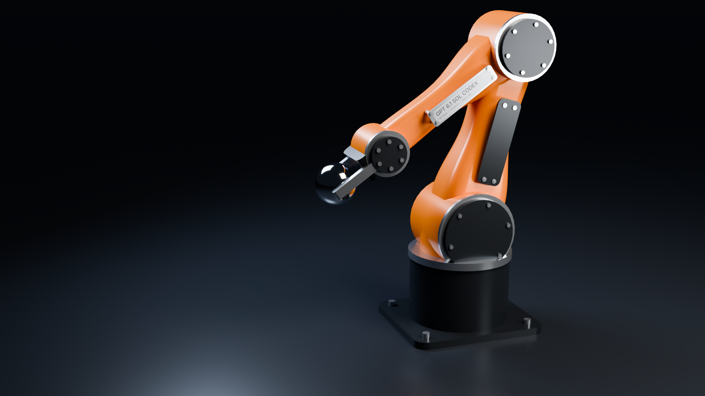
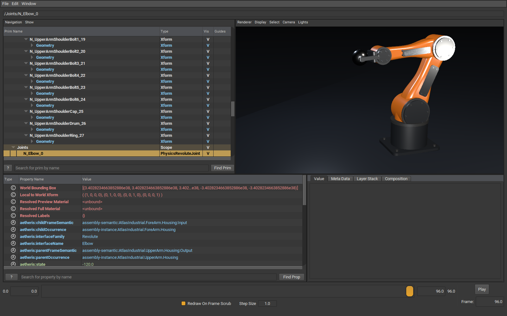

# Industrial ATLAS — one bounded styling round

Verdict: **Success** for the requested modeling, USD and slide-asset round. The original rectangular/perforated ATLAS remains the technical X0 witness. This separate industrial assembly adds smooth tapered housings, black circular joint covers, machined rings, shared fasteners, a bolted pedestal, a cleaner parallel gripper and a maker plate.

The intent is an original compact industrial elbow arm. KUKA's [KR IONTEC product images](https://www.kuka.com/en-gb/products/robotics-system/industrial-robots/kr-iontec), [Foundry application image](https://www.kuka.com/en-us/company/press/news/2022/10/kuka-supplies-36-robots-to-zf), and the three user-supplied references guided the orange/graphite palette, circular motor covers and enclosed housings. This is a two-link demonstrator, not a replica or a six-axis KUKA mechanism.

The built-in image generator produced a concept before CAD work. Its full prompt is preserved in [concept-prompt.txt](usd-industrial-atlas/concept-prompt.txt); the generated concept remains `artifacts/local/usd-industrial/design-concept.png`. It is design direction only. The image below is a direct **Cycles render of the exported USD import**, not a generated concept or an edited render.



## What was modeled

Source: `fixtures/Canonical/AssemblyInterfaces/IndustrialAtlas/atlas-industrial.firmament`, with `upper-housing.firmament`, `fore-housing.firmament` and `appearance.json` beside it.

Both housings are capped five-section G1 SectionChains. Rounded profile normalization and smooth loft selection are existing Aetheris capabilities; their STEP materialization/reimport remains the assembly definition path. Ordinary exact circle/ring/rounded-rectangle extrusions supply the pedestal, mounting plate, drums, caps, rings, jaw bodies, cover plates, standoffs and fasteners. All 60 part occurrences use 24 shared definitions; four product groups bring the USD occurrence count to 64. The accepted Interface model supplies two Revolute joints, two Prismatic slides and 55 Fixed relationships. No joints are inferred from geometry.

The upright elbow silhouette and short gripper replace the flat SCARA presentation. Satin orange enamel, graphite covers, silver rings, broad studio reflections and a dark floor make the construction legible. The camera leaves useful negative space for a slide title. The maker plate reads **GPT 6.1 SOL CODEX** with an AETHERIS / ATLAS-02 subtitle.

Engineering authority: the Aetheris solids, shared definitions, occurrence hierarchy, datum frames and deterministic joint states. `atlas.step` is the exact AP242 engineering assembly at its reference configuration; `atlas.usda` is the posed/animated downstream scene. Appearance is a preview preset, not density or a manufacturing material specification.

The assembly STEP extraction/reimport succeeds with 24 definitions, 60 part bodies, three nested subassemblies and 36 repeated instances. Single-part `analyze` correctly rejects this multi-root assembly; validation uses `asm import-step` instead.

Presentation: floor, chrome sphere, lighting, camera and printed maker-label texture live in a separate USD layer. The maker plate itself is an exact solid, but its printed letters are a downstream texture, not engraved BRep geometry. The sphere follows the gripper for visual choreography; this is not simulated grasp/contact physics.

## Capability extension and verification

The first G1 export revealed 688 unmatched display edges on the forearm. Independent UV grids on adjoining patches did not share subdivisions. `RectangularSplineDisplayTessellator` adds a bounded display route for natural rectangular B-spline patches and single-loop convex planar caps. It checks that each patch's four natural sides match source BRep edges, samples each edge once, reuses those positions on every incident face, and preserves separate face normals. A common grid is refined against sampled chord/normal checks, capped at 256 segments. It does not alter exact geometry or support arbitrary trimmed splines, holes, concave caps or generic remeshing.

The regression test checks both real housings for two triangle uses per welded edge, triangle/normal orientation and positive enclosed volume. External OpenUSD checks cover hierarchy, native instancing, materials, schema types, joint frames, all 97 authored poses plus the default pose, physical scale, bounds and closure. Every definition now has **zero unmatched display edges**. Maximum world-matrix error is **8.89e-16**; tight display bounds differ by **1.77e-6 mm**, inside the 0.0001 mm check tolerance. USD explicitly declares millimetres (`metersPerUnit = 0.001`), Z-up and right-handed geometry.

## External validation

Tool: NVIDIA-distributed official OpenUSD **usdview**, Hydra Storm renderer, plus **usdchecker** and the external `pxr` SDK.

Version: **OpenUSD 25.08**, runtime `(0,25,8)`.

Source/download: [NVIDIA OpenUSD Windows Python 3.12 distribution](https://developer.nvidia.com/downloads/usd/usd_binaries/25.08/usd.py312.windows-x86_64.usdview.release-v25.08.71e038c1.zip). Installation and checksum are pinned in [USD-EXPORT-X0](USD-EXPORT-X0.md).

USD file: `artifacts/local/usd-industrial/atlas.usda`; presentation layer `atlas-studio.usda` references it.

Opened successfully: **Yes**, actual usdview window and Hydra viewport; both product and studio layers pass usdchecker. Default and sampled world transforms agree with Aetheris.

Warnings: final usdchecker and usdview logs contain no schema/composition warnings. The label's primvar-reader input initially used `token`; usdchecker required the standard `string` type, which was corrected. Blender logs contain a `World.use_nodes` deprecation warning, with successful rendering.

Joint metadata visible: **Yes**, the actual selected Elbow prim is a `PhysicsRevoluteJoint`, with endpoint relationships, frames and Aetheris state metadata. Fixed and Prismatic schemas also pass independent SDK inspection.

Screenshot path: [usdview-hierarchy.png](usd-industrial-atlas/usdview-hierarchy.png). Viewer frames 0, 48 and 96 remain under `artifacts/local/usd-industrial/usdview/`.



Final render tool: installed **Blender 5.2.2 LTS**, build `d13f752e3b9c`, Cycles / NVIDIA OptiX on **RTX 3070**. Blender imports the actual USD through `bpy.ops.wm.usd_import`, with instancing and preview materials. The hero is 2560×1440, 192 samples with denoising. The imported engineering meshes are unchanged. Separate Omniverse/Isaac/RTX simulation qualification remains outside this styling round.

Two reader-specific presentation issues were isolated: Blender dropped material bindings on imported Cube/Sphere shape primitives, so the studio layer uses explicit presentation meshes. It also left imported RectLight transforms/dimensions in mm while camera/meshes converted to metres; the bounded renderer script corrects only those presentation lights and records their Cycles energies (Key 80 W, Rim 80 W, Fill 40 W). No Aetheris transform or unit contract was changed for one renderer.

## Reproduction and evidence

```powershell
dotnet build Aetheris.slnx -c Release --no-restore -m:1
pwsh -File scripts/qualify-usd-export-x0.ps1 -SkipBuild
pwsh -File scripts/qualify-industrial-atlas.ps1 -Render -Motion
dotnet test Aetheris.Kernel.Core.Tests -c Release --no-build --filter "Category!=SlowCorpus"
dotnet test Aetheris.slnx -c Release --no-build -m:1 -- RunConfiguration.MaxCpuCount=1
```

The first qualification script installs the pinned NVIDIA SDK. `-UsdRoot` reuses an existing installation; `-Blender` selects an executable. All generated files default to ignored `artifacts/local/`. The exact viewer command, under that SDK's PATH/PYTHONPATH, is:

```powershell
python scripts/capture-usd-export-x0.py artifacts/local/usd-industrial/atlas-studio.usda --camera /Presentation/HeroCamera --defaultsettings --timing
```

`qualify-industrial-atlas.ps1` sets frames 0,48,96 and captures the real viewer. It exports 97 smooth evaluated states over 0–96 time codes, renders 25 sampled frames in Cycles, and encodes a four-second H.264 clip at `artifacts/local/usd-industrial/atlas-motion.mp4`. Shoulder/elbow and parallel jaws move without IK. The final pose at time 48 matches the default exported hero state: Shoulder −75°, Elbow −140°, both jaw slides 10 mm.

One-run measurements: display mesh preparation **352 ms**, USDA serialization including 97 poses **142 ms**, product file **2,900,033 bytes**, external SDK stage load **101 ms**, usdview stage load **128 ms**, UI startup **965 ms**. Cycles USD import/scene preparation took **0.20 s**, final hero render **96.1 s**. These are development measurements, not optimized benchmarks.

Release build passed with seven existing WebAssembly/SQLite warnings; the fast lane passed 1,005 tests; the final full serial gate passed **all 4,010 tests**, zero failures/skips. The first full attempt, concurrent with Cycles rendering, passed 4,008 and failed two existing legacy display-budget tests: `TwoLocalHoles_ShareOneTrimmedHostAndRoundTrip` exceeded its 10-second budget after 12,541 ms, and `DisplayPrepare_Ftc07_ReturnsPartialDisplayInsteadOfWholeBodyFailure` had no patches within its five-second budget. These tests do not call the new structured spline lane. Both passed together in two seconds after rendering finished, and the identical full gate then passed without source changes or increased time budgets. Resource contention is the supported explanation; both attempts remain in the local logs and compact record.

The motion clip contains 100 encoded frames at 1280×720 over **4.166667 seconds** (352,126 bytes), from 25 directly rendered USD poses; motion rendering took 77 seconds. The [compact qualification summary](usd-industrial-atlas/qualification-summary.json) preserves counts, timings, errors and test evidence. Screenshot/render bytes can vary by GPU/driver; sources, exact workflows and settings above provide reproduction. Raw logs, detailed mesh/pose evidence, STEP/USD, .blend, textures, concept image and video remain local.
